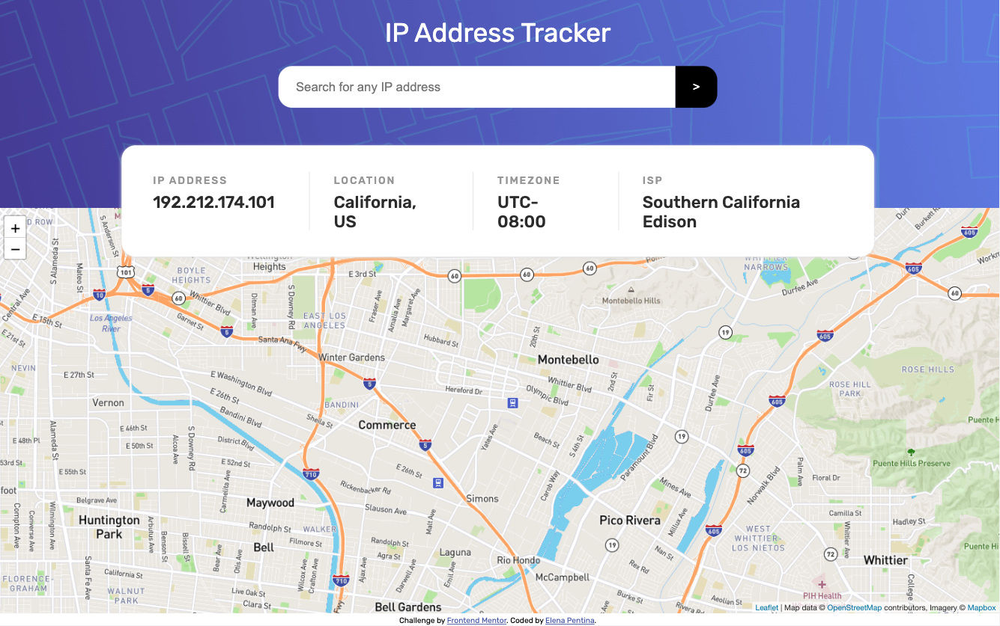

# Frontend Mentor - IP address tracker solution

This is a solution to the [IP address tracker challenge on Frontend Mentor](https://www.frontendmentor.io/challenges/ip-address-tracker-I8-0yYAH0). Frontend Mentor challenges help you improve your coding skills by building realistic projects.

## Overview

### The challenge

Users should be able to:

- View the optimal layout for each page depending on their device's screen size
- See hover states for all interactive elements on the page
- Search for any IP addresses or domains and see the key information and location

### Screenshot

### Links

- Solution URL: [https://www.frontendmentor.io/solutions/ip-tracker-with-leaflet-and-ipify-apis--sKpMtnHd](https://www.frontendmentor.io/solutions/ip-tracker-with-leaflet-and-ipify-apis--sKpMtnHd)
- Live Site URL: [https://epent.github.io/ip-address-tracker/](https://epent.github.io/ip-address-tracker/)
